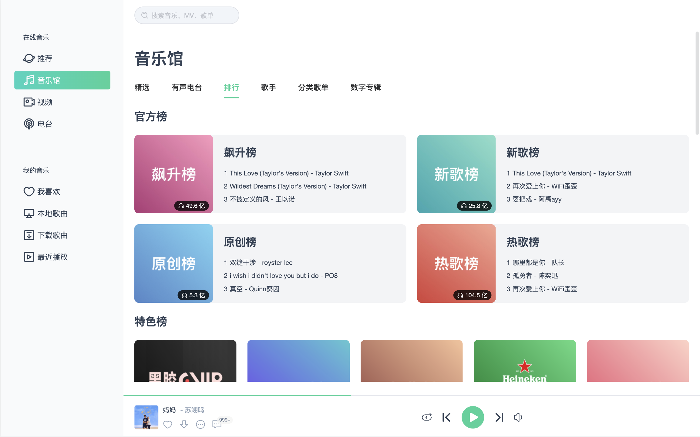
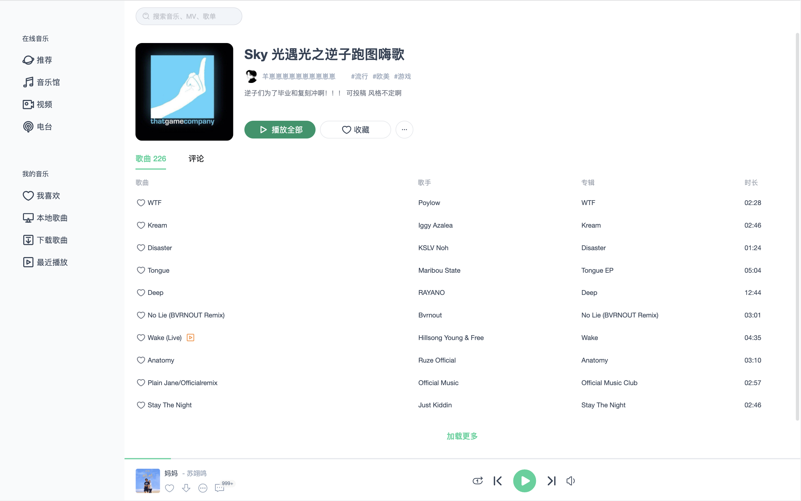

# Penguin Music

VUE3+TS+JS 開發的音樂播放器，界面模仿企鵝音樂mac客戶端。

基於此項目改造：
https://github.com/SmallRuralDog/vue3-music

## 本地安装

```
git clone https://github.com/SmallRuralDog/vue3-music.git
cd vue3-music
yarn
yarn run dev
```

## 网易云音乐API
目前需要运行API服务才能正常体验，未來會改成企鵝音樂的API服務

[开发文档](https://binaryify.github.io/NeteaseCloudMusicApi)


## UI





